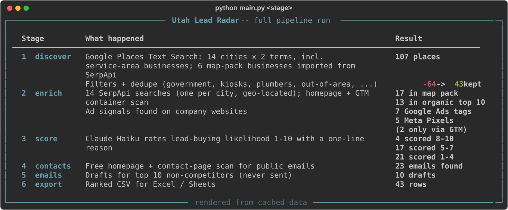
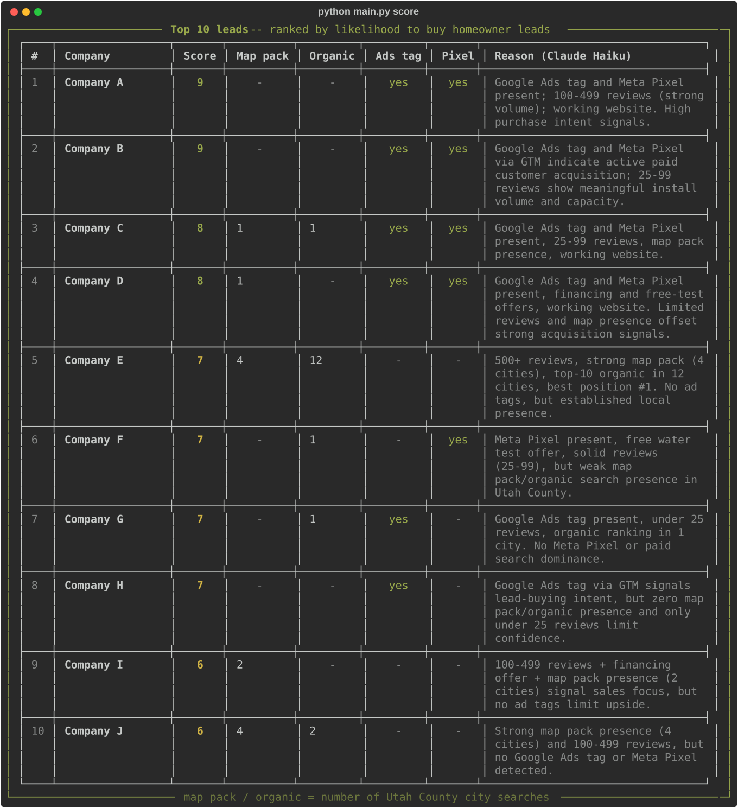
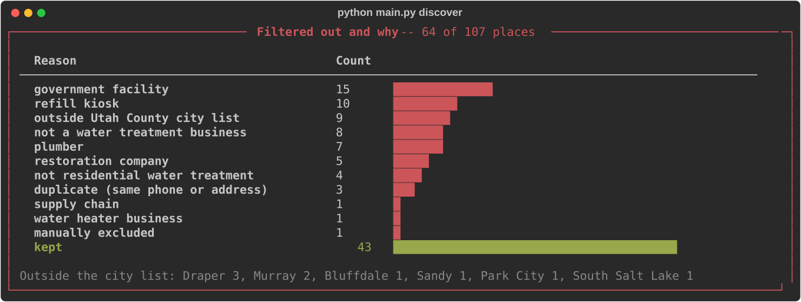

# Utah Lead Radar

*Built by Shennan in one evening with Claude Code. [LinkedIn](https://www.linkedin.com/in/stoelupe/)*

A small Python pipeline that finds the water softener / water treatment
companies in Utah County — 43 of them across 14 cities — measures how
actively each one markets itself, has Claude Haiku score how likely it is
to **buy homeowner leads**, and drafts short, personalized intro emails for
the top 10, referencing [utahwaterguide.com](https://utahwaterguide.com), an
independent water-hardness resource.

**Why I built it:** to find lead buyers for my own site,
[utahwaterguide.com](https://utahwaterguide.com).

It runs almost entirely on free tiers, and every paid or rate-limited call
is cached, so reruns cost nothing.


*A full run: 107 places found, 64 filtered out, 43 companies scored, 10 email drafts.*


*The top 10 leads, with the search and ad signals behind each score and Claude's one-line reason.*


*What the filters removed: city utilities, refill kiosks, plumbers and out-of-area listings.*

Want the underlying data without running anything? See
[`sample_output/sample_leads.csv`](sample_output/sample_leads.csv) (top 5
rows).

> **Business names anonymized in public samples.** The images and sample CSV
> show companies as "Company A, B, C…" by rank, with phones, websites and
> contact emails removed, and review counts and ratings bucketed (reviews:
> under 25 / 25-99 / 100-499 / 500+; ratings: 5.0 / 4.5+ / 4.0+ / under 4.0),
> including inside the reasons. Scores and signals are real. Full results
> stay in `data/`, which is gitignored.

## What it found

- **Nobody is bidding on these searches.** 0 of 14 geo-located "water
  softener {city} utah" searches showed a paid ad. Local Services Ads
  appeared in just 1 of 14, and only for two big plumbing/HVAC firms.
- **Few companies run ad pixels.** 8 of 43 companies have a Google Ads tag or
  a Meta Pixel on their site, and 2 of those 8 were only detectable inside
  their Google Tag Manager container. A plain HTML scan would have missed them.
- **Places' default search misses service-area businesses.** 18 of the 43
  companies are service-area businesses (no storefront address) that
  default Places Text Search doesn't return. 6 of them hold Google map-pack
  spots, including two that appear in the map pack for 4 cities each.
- **The best leads already pay for ads.** The top 4 (scores 8–9) all combine
  a Google Ads tag with a Meta Pixel. No company without either one scored
  above 7.

## Pipeline

```
discover -> enrich -> score -> contacts -> emails -> export
```

| Stage | Module | What it does | External calls |
|---|---|---|---|
| 1. discover | `src/discover.py` | Google Places Text Search for 2 terms x 14 cities, then filters (government facilities, refill kiosks, plumbers, restoration, supply chains, water-heater shops, out-of-area) and dedupes by phone **or** street address. Also imports map-pack businesses that Places never returned. | Google Places (cached) |
| 2. enrich | `src/enrich.py` | One geo-located Google search per city via SerpApi: records who appears in paid ads, Local Services Ads, the map pack and organic top 10. Scans each homepage for a Google Ads tag, GA/GTM, Meta Pixel, financing and free-water-test offers — including tags hidden inside Google Tag Manager containers. | SerpApi (cached), company homepages (cached) |
| 3. score | `src/score.py` | Claude Haiku scores each company 1–10 on lead-buying likelihood with a one-line reason, using structured output. Competitors score 0 with no API call. | Anthropic API (cached per company) |
| 4. contacts | `src/contacts.py` | Finds public contact emails from the homepage + contact page (mailto links, plain text, Cloudflare-obfuscated addresses). | Company websites (cached) |
| 5. emails | `src/emails.py` | Drafts partnership emails for the top 10 non-competitors, assigns send waves and flags companies in the same city. **Drafts only — there is no sending code.** | Anthropic API (one sentence per draft) |
| 6. export | `src/export.py` | Writes a ranked `data/leads.csv` for Excel / Google Sheets. | none |
| docs | `src/render_docs.py` | Renders the SVGs above and the anonymized sample CSV with [`rich`](https://github.com/Textualize/rich), from cached data only. | none |

## Key design choices

**Cache everything that costs money or quota.** Places results, SerpApi
responses, website scans, GTM containers, contact scans and Claude scores
are all cached in `data/` along with the query that produced them. A normal
run only calls APIs for queries it hasn't made before; `discover --offline`
re-applies changed filters with zero calls. Scores are cached per company
and reused while the company's signals are unchanged, so reruns don't
reshuffle rankings.

**Hard quota caps.** `MAX_PLACES_QUERIES`, `MAX_SERPAPI_QUERIES` and
`MAX_COMPANIES` in `config.py` bound every run, so a bug can't quietly burn
a free-tier quota. `--limit N` makes cheap test runs of any stage.

**Search from the right place.** SerpApi searches carry a `location` for
each city. Without one, Google answers from a default US location, and
geo-targeted local ads and map packs never show up.

**Don't miss service-area businesses.** Places Text Search leaves out
businesses with no storefront unless `includePureServiceAreaBusinesses` is
set — and several of the strongest local competitors are exactly that. They
have no public address, so the city filter judges them by the city search
that surfaced them.

**Find ad pixels that aren't in the HTML.** Many sites load their Google Ads
and Meta tags through Google Tag Manager, so a plain HTML scan misses them.
For every `GTM-XXXX` container on a page, the pipeline fetches
`googletagmanager.com/gtm.js?id=...` and checks the container itself
(`AW-` IDs, `__awct` conversion tags, `fbq` / `fbevents.js`). Results are
marked "via GTM".

**Flag instead of delete.** Companies can carry a `flag`. Flags starting
with `competitor` (e.g. a lead-gen site) keep the company in the data but
score it 0 and skip it for emails; informational flags like `site down`
(set automatically when a domain no longer resolves) don't block outreach.

**Keep the model honest.** The scoring prompt has explicit calibration
bands (no ad tag or pixel → max 7). For emails, the copy is fixed text in
code; the model writes only one personalization sentence, from a single
fact that code picks. Code checks that sentence for flattery, length and any
claim about the site's traffic or users, and retries once if needed.
Ad-signal facts skip the model and always read "I noticed you're already
investing in online marketing."

## Setup

1. Python 3.10+ (`anthropic` 1.x requires it).
2. Create a virtual environment and install dependencies:
   ```
   python -m venv .venv
   .venv\Scripts\activate          # macOS/Linux: source .venv/bin/activate
   pip install -r requirements.txt
   ```
3. Copy `.env.example` to `.env` and fill in:
   - `GOOGLE_PLACES_API_KEY` — Google Cloud project with **Places API (New)** enabled
   - `SERPAPI_API_KEY` — free SerpApi account
   - `ANTHROPIC_API_KEY` — Anthropic API key

   Keys are read only from `.env` (never from system environment variables).

## Run

```
python main.py discover --limit 2   # cheap test: first 2 city/term queries
python main.py discover             # full run (skips cached queries)
python main.py discover --offline   # re-filter cached results, no API calls
python main.py enrich --limit 2     # SerpApi for the first 2 cities only
python main.py enrich               # all cities + website/GTM scan
python main.py score                # score all -> data/scored_companies.json
python main.py contacts             # public contact emails (free)
python main.py emails --limit 2     # test-draft 2 emails (printed, not saved)
python main.py emails               # draft top 10 -> data/email_drafts.json
python main.py emails --rebuild     # re-apply changed email copy, no API calls
python main.py export               # -> data/leads.csv
python main.py docs                 # README images + sample CSV, from cache
```

Everything the pipeline writes goes to `data/`, which is gitignored.

## Cost

About **$0 plus a few cents of Claude Haiku** per full run:

| Service | Used per full run | Free tier |
|---|---|---|
| Google Places Text Search | ~28 searches + a handful of lookups (field-masked) | 1,000 calls/month per SKU |
| SerpApi | 14 searches (one per city) | 250 searches/month |
| Claude Haiku 4.5 | ~45 short scoring calls + 10 email drafts | pay-as-you-go — pennies |
| Website / GTM / contact scans | plain HTTP, cached | free |

Reruns are close to free because of the caches.

## Configuration

Everything tunable lives in `config.py`: search cities vs. allowed cities
(all incorporated Utah County cities), search terms, quota caps, manual flags
(`FLAGGED_COMPANIES`) and exclusions (`EXCLUDED_COMPANIES`), which flags skip
emails, the Claude model, and the sender details.

## Adapting it

The pipeline isn't specific to water softeners. To target any local service
niche (roofers, HVAC, solar, pest control...):

1. In `config.py`, change `SEARCH_CITIES` and `ALLOWED_CITIES` to your
   region, and `SEARCH_TERMS` to your niche (e.g. `"roofing company"`).
   Also update `RESOURCE_DESCRIPTION` and the sender details.
2. In `src/enrich.py`, change the SerpApi query (`"water softener {city} utah"`
   in `_serp_key`) to match.
3. In `src/score.py`, rewrite `SYSTEM_PROMPT` to describe what you're selling
   and which signals matter. Keep the calibration bands.
4. In `src/discover.py`, adjust the name filters (`WATER_TREATMENT_NAME`,
   `PLUMBER_NAME`, etc.) that decide what counts as a real business in the
   niche.
5. Run the stages with `--limit` first to check the results before spending
   the full quota.

## Email drafts

Each draft follows the same structure, matching the
`utahwaterguide.com/partners` page:

- **Subject:** "A free partnership idea for {company}"
- **Greeting:** "Hi Spencer," when the contact email is clearly a first
  name, otherwise "Hi {company} team,"
- **Intro:** what utahwaterguide.com is, plus one personalization sentence
  from the company's real data (map-pack cities, reviews, ad signals, or
  location)
- **Partnership:** sending homeowners who want help to one local company
- **Free start:** the first 5 homeowner inquiries are free, with no contract
- **Closing:** apply at utahwaterguide.com/partners, or reply "yes"
- **Signature and footer:** sender, mailing address and an opt-out line

Everything except the personalization sentence is fixed text in
`src/emails.py` (mailing address and signature in `config.py`). Change the
copy there, then run `python main.py emails --rebuild` to update saved
drafts without any API calls. Drafts also get a `send_wave` (top 3 by score,
next 3, then the rest) and an `email_city_conflict` flag when two targets
share a city, since the partnership offers one company per area.

## Notes

- Review every draft before sending it yourself; this tool never sends
  anything.
- Website scans identify themselves with a descriptive user agent, pause
  between requests, and hit each site at most once (cached).

## About the author

Built by Shennan, founder of [Utah Water Guide](https://utahwaterguide.com).
Questions or ideas: [LinkedIn](https://www.linkedin.com/in/stoelupe/)
